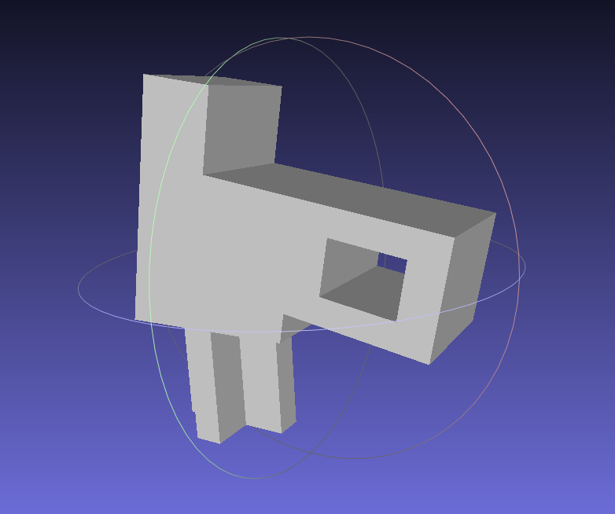

# VIC-20 (later rev) Spacebar Stabilizer 

I encountered a later revision of a Commodore VIC-20 with a broken stabilizer on the spacebar.
This part is a separate plastic piece from the rest of the key and is easily removable, and replaceable. 
So I modeled a 3 printable part to repair, and somewhat improve, the computer. I have resin printed this part and can confirm it works perfectly.

## Part info and Differences

There are two identical parts in the key originally that each hold one side of the stabilizer bar. The actual "loop" part that goes around the metal was only made about half as thick as the total part size though. This model is the full width of the key stem insert to add more strength to the part. This causes no functional issues nor changes any clearances.

## Model info

All dimensions of the model can be set in variables at the top of the file. The provided values are exact to the original part and if SLA printing should be left alone. If you attempt to FDM print this part you may want to tune these values to allow for variances in FMD clearance issues. I would strongly recommend SLA printing them though, even if you need to use a 3rd party service.